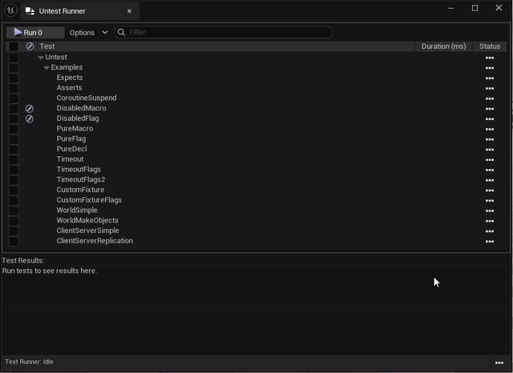

# Untested

Untested is a plugin is a code-focused testing framework plugin for Unreal.

## Features

The Untested framework has an interface modeled after GTest with has several features that enable more expressive, concise tests compared to the stock Unreal testing framework:
* First-class support for coroutines via the excellent [SquidTasks](https://github.com/westquote/SquidTasks) coroutine library. All test functions return coroutines, making it simple to write linear functions that test async functionality.
* Unit, World, and Client-Server tests. World tests spin up a server world, allowing for UObject-oriented testing. Client-Server tests spin up separate client and server worlds outside of PIE and connect them via a real NetDriver, and perform real replication between them.
* UI test runner with functionality similar to Unreal's Automation UI. Run tests selectively and see their total runtime.
* Commandlet to run tests from the commandline, including support for running subtests and exporting the results in a JUnit XML format.

## Getting Started

Clone this repository into your project's `Plugins/` folder and rebuild your editor. You will also need the [SquidTasks](https://github.com/westquote/SquidTasks) plugin.

See [UntestExamples.cpp](Source/Untested/UntestExamples.cpp) for examples of how to use the framework.
